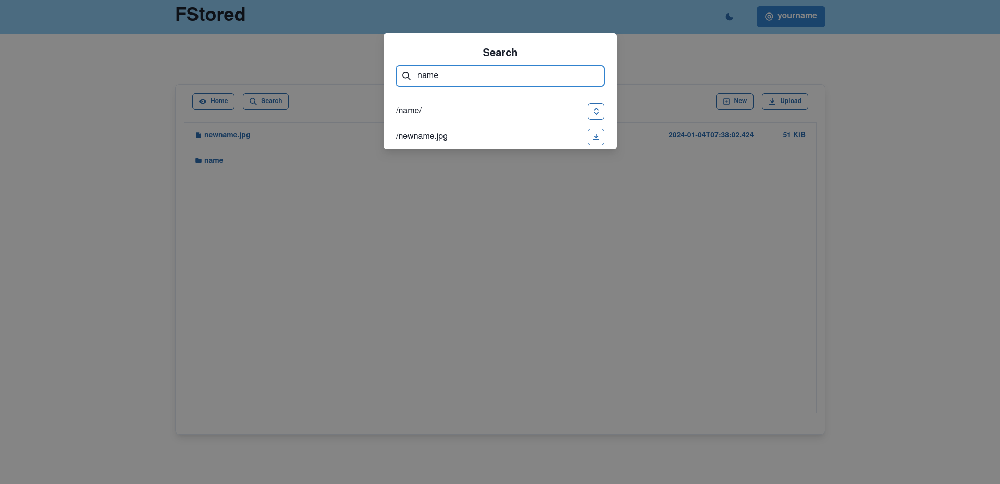

# :cloud: fstored

Cloud file storage. Something like [GoogleDrive](https://www.google.com/drive/) or [YandexDisk](https://360.yandex.com/disk/).

[Technical requirements](https://zhukovsd.github.io/java-backend-learning-course/Projects/CloudFileStorage/).

# table of contents
1. [features](#feats)
2. [technologies / tools](#tools)
3. [api overview](#api)
4. [build and run](#build)
5. [screenshots](#screenshots)


# features <a id="feats"></a>

### users:
- sign up
- sign in
- sign out

### Files/Folders:
- uploading/creating
- moving/renaming
- deleting
- fetching/downloading


# technologies / tools <a id="tools"></a>

### Backend:
- Java 17
- Spring boot
- MinIO
- PostgreSQL
- Redis
- Junit5, Mockito, Testcontainers
- Gradle
### Frontend:
- React/TS
- chakra-ui, axios, zustand
- Vite, Bun
### CI/CD:
- Docker, docker-compose
- Github actions


# api overview <a id="api"></a>

## user-access

```shell
# sign up
curl --verbose \
     --header 'Content-Type: application/json' \
     --request POST \
     --data '{"name": "yourname", "password": "passwd"}' \
     '/api/v1/user-access/sign-up'

# sign in
curl --verbose \
     --header 'Content-Type: application/json' \
     --request POST \
     --data '{"name": "yourname", "password": "passwd"}' \
     '/api/v1/user-access/sign-in'

# sign out
curl --verbose \
     --header 'Content-Type: application/json' \
     --cookie 'TOKENID=${token_id}' \
     --request POST \
     '/api/v1/user-access/sign-out'

# current active user
curl --verbose \
     --header 'Content-Type: application/json' \
     --cookie 'TOKENID=${token_id}' \
     --request GET \
     '/api/v1/user-access/active'
```

## storage/folders

```shell
# make empty folder
curl --verbose \
     --header 'Content-Type: application/json' \
     --cookie 'TOKENID=${token_id}' \
     --request POST \
     '/api/v1/storage/folders/path/'

# move/rename folder
curl --verbose \
     --header 'Content-Type: application/json' \
     --cookie 'TOKENID=${token_id}' \
     --request POST \
     '/api/v1/storage/folders/renamed/?mvfrom=/path/'

# fetch root folder content
curl --verbose \
     --cookie 'TOKENID=${token_id}' \
     --request GET \
     '/api/v1/storage/folders'

# fetch folder content
curl --verbose \
     --cookie 'TOKENID=${token_id}' \
     --request GET \
     '/api/v1/storage/folders/path/'

# recursive search in root folder
curl --verbose \
     --cookie 'TOKENID=${token_id}' \
     --request GET \
     '/api/v1/storage/folders?search=name'

# recursive search in folder
curl --verbose \
     --cookie 'TOKENID=${token_id}' \
     --request GET \
     '/api/v1/storage/folders/path/?search=name'

# remove folder
curl --verbose \
     --cookie 'TOKENID=${token_id}' \
     --request DELETE \
     '/api/v1/storage/folders/path/'
```

## storage/files

```shell
# upload file to root folder (file name from multipart request)
curl --verbose \
     --header 'Content-Type: multipart/form-data' \
     --cookie 'TOKENID=${token_id}' \
     --request POST \
     --form 'file=@/path/to/yourfile.ext' \
     '/api/v1/storage/files'

# upload file (file name from multipart request)
curl --verbose \
     --header 'Content-Type: multipart/form-data' \
     --cookie 'TOKENID=${token_id}' \
     --request POST \
     --form 'file=@/path/to/yourfile.ext' \
     '/api/v1/storage/files/path/to/'

# move/rename file
curl --verbose \
     --header 'Content-Type: application/json' \
     --cookie 'TOKENID=${token_id}' \
     --request POST \
     '/api/v1/storage/files/dst/path/renamed.ext?mvfrom=/path/to/file.ext'

# upload/overwrite file in root folder (file name from multipart request)
curl --verbose \
     --header 'Content-Type: multipart/form-data' \
     --cookie 'TOKENID=${token_id}' \
     --request PUT \
     --form 'file=@/path/to/yourfile.ext' \
     '/api/v1/storage/files'

# upload/overwrite file (file name from multipart request)
curl --verbose \
     --header 'Content-Type: multipart/form-data' \
     --cookie 'TOKENID=${token_id}' \
     --request PUT \
     --form 'file=@/path/to/yourfile.ext' \
     '/api/v1/storage/files/path/to/'

# download file
curl --verbose \
     --cookie 'TOKENID=${token_id}' \
     --request GET \
     -OJ '/api/v1/storage/files/path/to/file.ext'

# remove file
curl --verbose \
     --cookie 'TOKENID=${token_id}' \
     --request DELETE \
     '/api/v1/storage/files/path/to/file.ext'
```


# build and run <a id="build"></a>

```shell
# clone repo
git clone https://github.com/makeitvsolo/fstored.git

cd ./fstored/compose

# build and run
docker-compose -f compose-local.yml build

docker-compose -f compose-local.yml up

# then go to localhost in your browser
```


# screenshots <a id="screenshots"></a>


